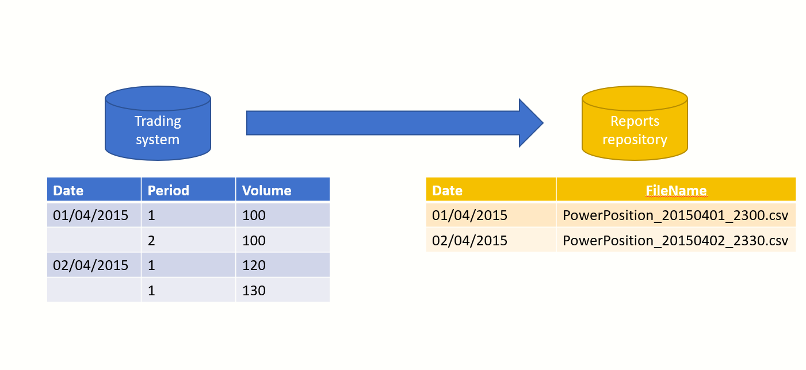
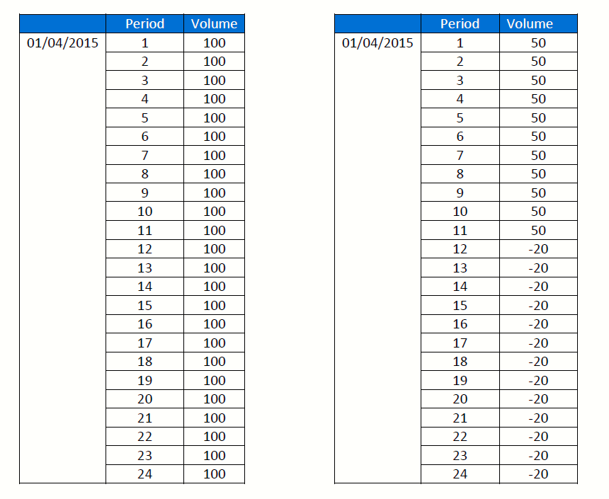
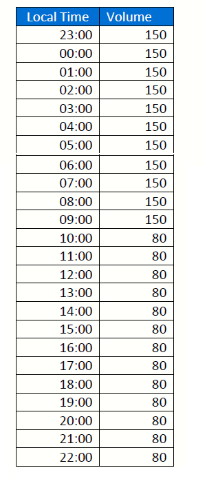
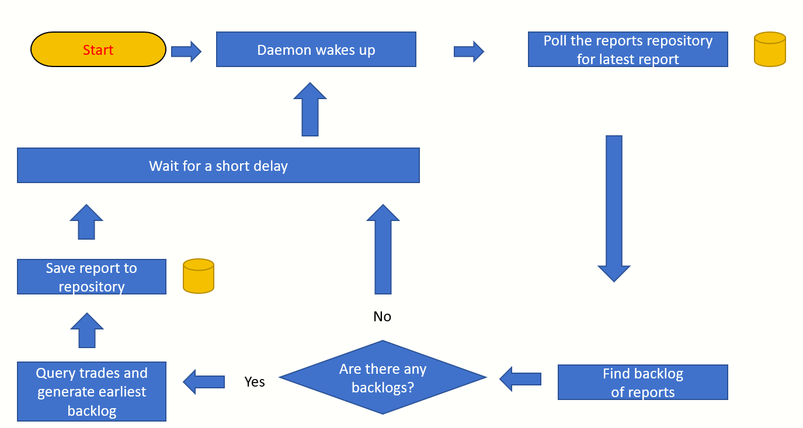
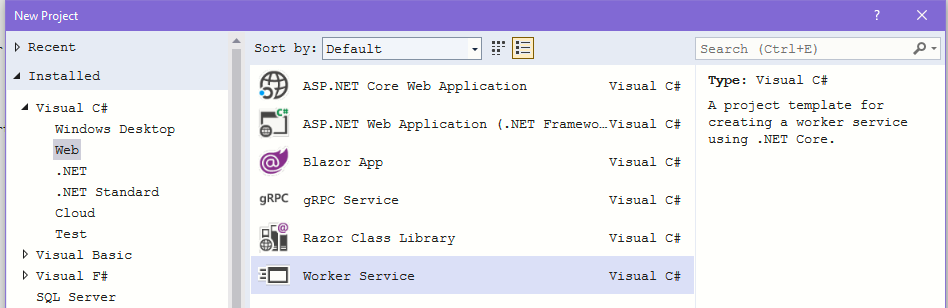
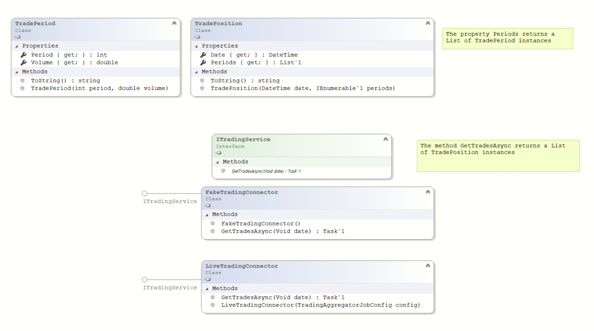
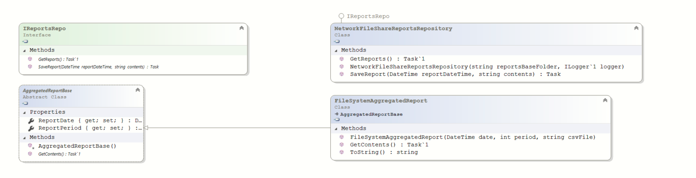
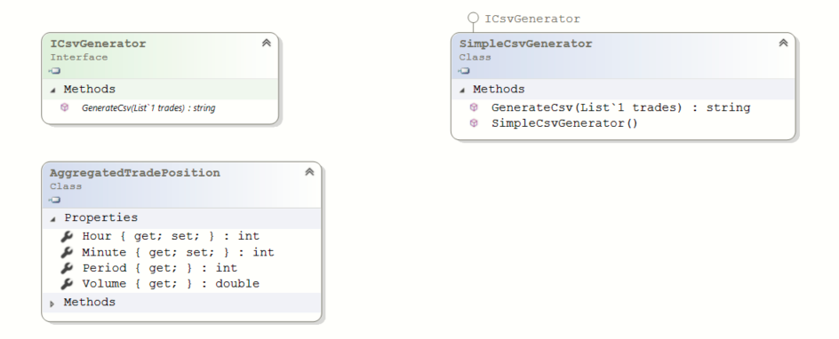
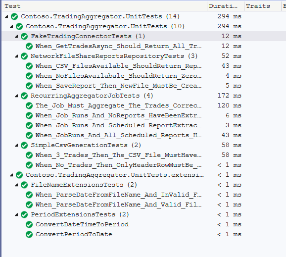

# Periodic report generation system for Contoso using .NET Core


# Overview

This is an abstraction of a real life problem. For the purpose of this discussion we will talk in terms of a fictious company called Contoso. The company **Contoso** has a Trading system which captures trading volumes for every stock position on an hourly basis.
Contoso wants a solution where aggregated trading reports can be produced at a regular intervals and saved to a certain data store.


---

# Why the name Contoso?
Consotos is a fictitious company [created by Microsoft](https://docs.microsoft.com/en-us/microsoft-365/enterprise/contoso-case-study?view=o365-worldwide) and used by Microsoft for documenting various technological white papers and paradigms.

---


# Core requirements
1. The implementation should be an application which can run as a background service (daemon). 
1. Trading day starts at **23:00** on the previous day and spans for 24 hours
1. For the sake of simplicity, the **GMT** timezone will be used to obtain the current clock time
1. All trades must be aggregated on an hourly basis (i.e. sum of all trades across all positions in any given hour ,23:00 to 00:00, 00:00 to 01:00, etc.)
1. The CSV will have 24 rows, 1 for each hour starting at 23:00 previous day and ending at 22:00 on the current day (see below)
1. The location of the CSV file should be stored and read from the application configuration file or environment variables. (E.g. In case of a file based reports repository this would be the UNC path of a shared folder )
1. An extract must run at a scheduled time interval; every **X minutes** where the actual interval X is stored in the application configuration file. This extract does not have to run exactly on the minute and can be within +/- 1 minute of the configured interval.
1. **Important!** It is not acceptable to miss a scheduled extract.
1. An extract must run when the daemon first starts and then run at the interval specified as above.
1. It is acceptable for the service to only read the configuration when first starting and it does not have to dynamically update if the configuration file changes. It is sufficient to require a service restart when updating the configuration.
1. The service must provide adequate logging for production support to diagnose any issues.


# What is the expected structure of the CSV?
```
LocalTime,Volume
23:00,150
00:00,150
```

## Column definitions
1. **LocalTime** - Denotes the start of an hour (23:00, 00:00, 01:00, ... 22:00)
1. **Volume** - The sum of all volumes traded in the specified hour

## How many rows are expected in the CSV?
The report must capture trade volumes starting from 23:00 previous day upto the current hour.
Example:
If the report extraction runs at 02:30, then the last row in the CSV should capture all trades upto 02:00 to 03:00 hour period
- 23:00,[aggregated trading volume from 23:00 to 00:00]
- 00:00,[aggregated trading volume from 00:00 to 01:00]
- 01:00,[aggregated trading volume from 00:01 to 00:02]
- 02:00,[aggregated trading volume from 00:02 to 00:03]

# What is the structure of the data produced by the trading system ?

The interface to the trading system returns all trades across all positions for the specified data and grouped on an hourly basis
The hour is denoted by the **Period** field. The period number starts at 1, which is the first period of the day and starts at 23:00 (11 pm) on the previous day.


With the above raw information coming from the trading system over a 24 hour period, the expected CSV would be as follows:




# What are the various solution approaches?

## 1-Naive solution - A single command line executable written in procedural style using C# on the .NET Core platform
- A single .NET Core executable written in a procedural style
- The EXE polls the trading system at desired intervals
- The executable can be deployed to a physical server or a virtual machine on Azure.
- The scheduling can be done via Windows Task Scheduler or other enterprise schedulers like Autosys


## 2-A more robust solution  - A componentized .NET Core ASP.NET worker process deployable to Azure

- ASP.NET Core worker process as the outer shell
- Split into testable components and abstractions
- Poll the trading system at desired intervals
- Can be easily deployed on cheap containers or app services. No need for expensive Virtual Machines on the Cloud


## 3-Non coded approaches
- Sql Server Integration services  (SSIS)
- Azure Data factory
- Azure Synapse pipelines

---

# Solution overview

In this article, we will implement a solution using a **componentized ASP.NET Worker process** approach.

## Flowchart


## What is an ASP.NET Worker process?
There are numerous reasons for creating long-running services such as:
- Processing CPU intensive data.
- Queuing work items in the background.
- Performing a time-based operation on a schedule.

With .NET, you're no longer restricted to Windows. You can develop cross-platform background services. Hosted services are logging, configuration, and dependency injection (DI) ready. 

## How to create an ASP.NET Worker Service project using Visual Studio?




## ASP.NET Core Worker class

The core scheduler is implemented as an inheritance from Microsoft's `BackgroundService` class. 
The virtual method `ExecuteAsync` is designed to keep polling using a configured delay.
```
public class RecurringAggregatorJob : Microsoft.Extensions.Hosting.BackgroundService
{
    protected override async Task ExecuteAsync(CancellationToken stoppingToken)
    {
        while (!stoppingToken.IsCancellationRequested)
        {
            //Poll the reports repository for latest reports

            //Generate pending reports based on current clock time

            //Pause for a while
            await Task.Delay(this.DelayBetweenConsecutiveAttempts * 1000, stoppingToken);
        }
    }
}

```
- The class `RecurringAggregatorJob` is designed to poll the trading system at configured intervals
- The configuration is read from `appSettings.json`
- Dependencies like logger, trading connector and reports repository are wired through Dependency Injection

# Abstracting the trading systems connector component

The trading system is abstracted through the interface `ITradingService`. There are 2 implementations provided
- **FakeTradingConnector**-Generates a random sequence of trades and used for testing the system
- **LiveTradingConnector**-Connects to the live system.




# Abstracting the reports repository

The reports repository is abstracted through the interface `IReportsRepo` and the class `AggregatedReportBase` .
For this exercise a simple file based repository has been implemented in the class `NetworkFileShareReportsRepository`




# How to produce CSV content?
The popular 3rd party nuget package `CsvHelper` has been used. Refer class `SimpleCsvGenerator` which hides the implementation details



## Why is it advantegous to abstract the CSV? 
Abstracting the CSV production using the interface `ICsvGenerator` allows us to inject an instance via dependency injection. Refer the constructor of the **RecurringAggregatorJob** class below:

This not only separates the worker job from the CSV generation component during compile time, it also simplifies the unit testing. You do not need to test the actual CSV content while testing the work job class.  Just testing that the mocked object is more productive.

```dotnetcli
_csvGenerator.Verify(m => m.GenerateCsv(It.IsAny<List<AggregatedTradePosition>>()), Times.Once);
```


# Logging
Logging is essential for post-deployment support. You want to know what is going on your production boxes. We want to log exceptions and also general informational messages. This gives us insight into the performance and behaviour of the job. Think of logging as the black box of an aircraft. 

## How are we abstracting the logging?
All the components are using the `ILogger<T>` interface for logging. The `ILogger` interface comes from the `Microsoft.Extensions.Logging.Abstractions` package.

## What logging system are we using for this solution?
For this solution, the popular logging library **log4net** has been used. This was primarily for simplicity. 

```
    /*
    * Replace with a centralized logging system such as Application Insights (if on Azure)
    * https://docs.microsoft.com/en-us/azure/azure-monitor/app/ilogger#console-application
    */
    services.AddLogging(builder => builder.AddLog4Net());

```
The loggers are injected via dependency injection. Therefore replacing with a centralized logging like **Application Insights** should be fairly easy.

## How to use Azure Application Insights for logging?
Sample DI code for Application Insights below:
https://docs.microsoft.com/en-us/azure/azure-monitor/app/ilogger#console-application

```dotnetcli
                IServiceCollection services = new ServiceCollection();

                services.AddLogging(builder =>
                {
                    // Only Application Insights is registered as a logger provider
                    builder.AddApplicationInsights("<YourInstrumentationKey>");
                });
```
This is where we see **Dependency Injection** shining. Just a couple of lines of change in the initialization and we have re-wired the entire logging.

## How to initialize the destination store for Application Insights?
The deployment script (Infrastructure as Code) can use the Powershell cmdlet `Get-AzApplicationInsightsApiKey` to retrieve the key and then set this into app settings using the `Set-AzWebApp`

# How to ensure that no scheduled report generation has been missed?


Consider the case of a temporary outage. This could be caused by several reasons:
- A case of a container instance failing or an Azure web job instance not responding. 
- The trading system not responding in a timely fashion
- A temporary outage while writing the CSV to the reports repository

To handle such situations, the following logic has been employed in the class `RecurringAggregatorJob.cs`
1. Wake up
1. Query the reports repository for all reports that have been generated so far
1. Compute a table of desired report run timings
1. Compare the desired run timings with the reports that have been already generated
1. Find missing reports
1. Generate the missing reports
1. Wait for a configured delay
3. Repeat the above

So essentially, the report generation plays a catch up. To make this successful, it is important that the the report polling should run at a frequency higher than the report extraction frequency.
Example:
If we expect a report to be generated every **X minutes**, then polling delay should be X/2 minutes (as an example).


# How does ASP.NET Worker process deal with configuration files?
The settings are first read from the file  `appSettings.json` and then layered with values from the environment variables (if any)

## What is the structure of the appSettings.json file?
Structure of appSettings.json is as below:
```
{
  "ReportsFolder": "c:\\truetemp\\pitl_challenge\\",
  "MaximumSecondsDelayBetweenConsecutiveReporExtrations": 100,
}
```

## How is the settings file read by the application?

The `CreateHostBuilder` method reads the file `appSettings.json` and produces an `IConfiguration` instance. 
```
    public static class Program
    {
        public static IHostBuilder CreateHostBuilder(string[] args) =>
            Microsoft.Extensions.Hosting.Host.CreateDefaultBuilder(args)
                .ConfigureServices((hostContext, services) =>
                {
                //
                //
                }
    .
    .
    .
```
**Example:** If there is an environment variable **MaximumSecondsDelayBetweenConsecutiveReporExtrations** defined then the environment variable takes precedence over the the value in the appsettings.json file.


## How are the settings passed into the various components?

The settings are serialized during DI initialization:
```
    services.AddSingleton<TradingAggregatorJobConfig>(sp =>
    {
        var configuration = sp.GetService<IConfiguration>();
        var jobConfig = new TradingAggregatorJobConfig();
        configuration.Bind(jobConfig);
        return jobConfig;
    });

```


# Understanding the accompanying code
## Running the EXE
- The main executable is implemented in the project **Contoso.TradingAggregator.Host** project
- The configuration file **appsettings.json** has the path to the folder used as a reports repository
- The configuration file also controls the report generation interval and polling interval

## Running the unit tests

Implemented in the project **Contoso.TradingAggregator.UnitTests**


## List of projects

- **Contoso.TradingAggregator.Domain** - Core domain classes and interfaces
- **Contoso.TradingAggregator.TradingConnector** - Implements a random trade generator for demonstration and a live connector using Contoso's proprietary assembly
- **Contoso.TradingAggregator.TradingReportsRepository** - Implements a simple file system based reports repsitory
- **Contoso.TradingAggregator.Jobs** - The ASP.NET Core inheritance from `BackgroundService` class and CSV generation component

# Deploying to Azure
The existing solution can be very easily deployed to Azure as a Web job.
Please refer my project on Github for Azure CLI/PowerShell sample code.
https://github.com/sdg002/AnyDotnetStuff/tree/master/DemoWebAppWithCiCd
- Create an Azure resource group
- Create an Azure App Service plan
- Create a Azure App
- Deploy the DLLs 

# How can we change the implementation of the reports repository?


Consider the hypothetical example of using an Azure Blob storage as a reports repository.
- Implement the interface **IReportsRepo**  in a new class called **AzureBlogReportsRepo** (as an example)
- Implement the abstract class **AggregatedReportBase** in a new class called **AzureBlogReportBase**. 
- Change the initialization in dependency injection 
- Provide the neccessary app settings.

```
services.AddSingleton<IReportsRepo>(sp =>
{
    return new NetworkFileShareReportsRepository(
        sp.GetService<TradingAggregatorJobConfig>().ReportsFolder,
        sp.GetService<ILogger<NetworkFileShareReportsRepository>>()
        );
});

```

# Improving the resilience of by incorporating retry logic
Any cloud native application has to interact with services sooner or later. Some of these services could be in a different data center or availability zone. It is safe to assume that there could be moments of disruption caused by network outages or some form of infrastructure unavailability.

```dotnetcli

public void SomeActivity()
{
    AsyncRetryPolicy retryPolicy = CreateExponentialBackoffPolicy();
    var allExistingReports = await retryPolicy
        .ExecuteAsync<List<AggregatedReportBase>>(() => _reportsRepo.GetReports());

}
        
private static AsyncRetryPolicy CreateExponentialBackoffPolicy()
{
    return Policy
        .Handle<Exception>()
        .WaitAndRetryAsync(
        RetryAttempts,
        attempt => TimeSpan.FromSeconds(Math.Pow(2, attempt)));
}

```
# Alternative Scheduling approaches
Not in the scope of this solution. We could think of moving away from a polling based approach to a system which is trigerred by an external scheduling engine.
Such a system offers the advantage of complex schedules and load balancing.
- Hangfire
- Quartz.net
- Azure Deferred messages


# References

- [ASP.NET Worker Service](https://docs.microsoft.com/en-us/dotnet/core/extensions/workers)
- [Using Application Insights for logging](https://docs.microsoft.com/en-us/azure/azure-monitor/app/ilogger)
- [How to retrieve the Azure Application Insights instrumentation key using Poweshell?](https://docs.microsoft.com/en-us/powershell/module/az.applicationinsights/get-azapplicationinsightsapikey?view=azps-7.3.0)
- [How to configure the app settings of an Azure Web app?](https://docs.microsoft.com/en-us/powershell/module/az.websites/set-azwebapp?view=azps-7.3.0#examples)
- [Using Polly policies to improve resilience](https://docs.microsoft.com/en-us/dotnet/architecture/microservices/implement-resilient-applications/implement-http-call-retries-exponential-backoff-polly)
