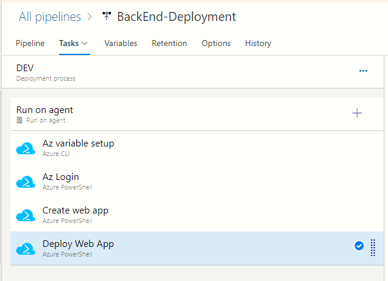

# CI/CD solution with Github, Azure Devops, Azure Cloud and CLI/PowerShell - So simple!

# Overview - What problem are we solving?
Imagine a very simple distributed application comprising of the following:
1. Back end tier which has a single REST end point
1. Front end comprises of a static HTML page which invokes the end point and renders the data. 
1. The code repository is maintained on **Github**
1. the build and deployment process is on **Azure Devops** and the actual application is deployed to **Azure** App Service and Storage account.

In this article, I have described in a step-by-step fashion how to implement a robust and repeatable **Continuous integration(CI)** and **Continuous deployment(CD)** process which takes the code commits and does the build, unit test, followed by deployment to various environments.  Links to accompanying code is towards the very end.


#### Why is it neccessary to have multiple environments (dev/uat/prod)?

- **Dev** - This is where the code that is comitted by the developer and not yet merged into the **master** branch is deployed. This environment gives the developer an opportunity to test her changes and get quick feedback. Pull Request comments are implemented and tested out.
- **Uat** - After the pull request has been completed, the code is now implemented to the **master** branch. This environment gives the developer and the product owners to examine the product and possibly recommend improvements.
- **Prod** - When the Product owner is happy , she would approve and trigger the deoployment of the **master** branch. This is a gated stage and might take into several factors. E.g. Deploy during quiter hours, do not deploy during long weekends, etc.

#### Why do we need to have a robust Pull Request experience?
You want the PR branch to be deoployed to a Dev environment. This is an environment that is safe and allows rapid feedback thereby leading to a better product quality
The PR deployment should be automated as much as possible.

#### How do you automate the deployment of infrastructure to the cloud?
The accompanying code in this article uses Azure Powershell and Azure CLI to implement the automation of the infrastructure. 


---

# Why did I write this article?

I wanted to demonstrate that if we stay committed to the fundamental tools and products like **Azure CLI**, **Powershell**, **Github** and **Azure Devops** - then a fairly complex process like CI/CD can be solved with relative ease. I often hear developers stressing how important it is to use a 3rd party Cloud management product like Terraform or Pulumi. If you are on **Azure** and have no itention for a multi-cloud solution, then CLI and PowerShell coupled with an automation agent like **Azure Devops** are all you need for your "Infrastructure as code" solution. This is in no way a criticism of rival products like **AWS**, **Jenkins**, etc. or a promotion of Microsoft. 

---

# What sort of application are we automating in this article?

For the purpose of demonstrating a working CI/CD solution, I have developed a very simple application which comprises of the following:
- One REST end point implemented in a .NET Core Web API project. This end point generates dummy weather forecast records
- Static HTML served out of a storage account (with static web site option enabled). This invokes the REST end point and renders the forecast on the web browser

In a more practical scenario you would have other assets like a central database, Redis cache, message bus and most probably multiple micrososervices hosted in their respective web app.

#### Block diagram


#### Browser rendition


---

# What are the key technologies involved?

- **Github** - Source code repository
- **Azure Devops** - Build (CI) and release(CD) pipelines
- **Azure** - The cloud platform where the infrastructure is deployed
- **Azure app service** -  Azure serverless compute service for hosting a REST end point implemented on .NET Core Web API
- **Azure storage account** - Azure storage account configured for serving static HTML content over HTTP

---

# What is the desired development workflow?
A classic CI/CD workflow with deployments to **dev-uat-prod** stages would be as follows. The workflow could be even simpler or more complex. Example of complex CI/CD scenarios:
- Carry out integration test after deployment to Dev where the REST end points are tested
- Deploy to a QA environment for carrying out load tests
- Carry out UI automated UI tests immediately after deploying to Dev


---

# How do we structure the Github repo?
I have followed a [Monorepo](https://en.wikipedia.org/wiki/Monorepo) approach for the toy application. This was mainly for simplicity. If you are following a Monorepo then there are certain guidelines to be followed in the YAML file, so that the CI/CD automation environment (Azure Devops) can respond correctly to code commits in the source repository (Github). This is discussed further down.

```
|                       
+---BackEnd
|   +---build
|   |       build.yml
|   |       
|   +---infrastructure
|   |       common.ps1
|   |       createwebapp.ps1
|   |       deploy.ps1
|   |       
|   \---src
|                       
|           
+---FrontEnd
|   +---build
|   |       build.yml
|   |       
|   +---infrastructure
|   |       deploy.ps1
|   |       
|   \---src
|                   
```
You will notice that the repo is structured into 2 top level folders **BackEnd** and **FrontEnd** which contain a .NET Core WebApp and static HTML assets respectively.

Both the folders have their respective **build.yml** and **IAC** PowerShell scripts.

---

# How do we structure our assets on the Azure cloud (to be done, is this the right folder)?

1. Show a pic of resource groups
2. Explain the naming of the resource groups

# How does Azure Devops orchestrate our CI/CD pipelines (to be done?

Azure Devops will listen for checkin events via web hooks and kick of the build pipelines (CI)


show a picture , similar to above, with some arrows, depicting code checkins, split into CI+CD

---

# What is the responsibility of the Continuous Integration(CI) pipeline?  (to be done)

The CI pipeline is defined by a set of ordered tasks written down in a YAML file. The most common tasks performed by CI stage are:
1. code checkout
1. code compilation
1. unit tests
1. code coverage analysis
1. quality gates assessment (e.g. Sonar Cloud integration)

Example of a YAML snippet which executes the .NET unit tests in the **BackEnd** project

```
- task: DotNetCoreCLI@2
  displayName: Test
  inputs:
    command: test
    projects: '**/*[Tt]est*/*.csproj'
    arguments: '--configuration $(BuildConfiguration)'

```

---

# What is the responsibility of the Continuous Integration(CD) pipeline?
The CD stage is responsible for collecting the build output from CI stage and then executing the IAC scripts. The CD is futher split into environment specific stages. It could get more complex. E.g. Kick of a load test after deployment to Dev environment is complete.

#### 3 stages of infrastructure deployment (dev/uat/prod)


#### Variable initialization
The variable **environment** (could be any name) influences the PowerShell script. The PowerShell script will use this environment variable to control the names of the assets in the cloud.

**Example**: In the following Powershell snippet, the resource group containing our assets is named as per the environment.
```
$environment=$env:ENVIRONMENT
if ([string]::IsNullOrWhiteSpace($environment)){
    Write-Error -Message "The variable 'environment' was empty"
}

$ResourceGroup="rg-$environment-demo-webapp-with-cicd"

```


#### How does Azure Devops establish a connection with Azure cloud?

A one-time connection trust between Azure Devops and Azure cloud needs to be established. This is done via the **Service connections** panel of **Azure Devops**.


You will also need to register a new **Application** in Active Directory


#### How to specify the connection to Azure cloud?
The service connection created in the previous step is now available for use in any of the stages. 
**Example**: In the case of a **Azure CLI** task or a **Azure PowerShell** task, this can be specified in the drop down labelled *Azure Resource Manager Connection*


#### What are the tasks in each of the stages?



#### What is the difference between dev,uat and prod stages?

The steps are nearly identical. They all point to the same PowerShell scripts. So what is the difference? 
 -The variables differ. E.g. the variable *environment*
 -The service connection used by Devops to connect to the Azure cloud may differ. E.g. An UAT subscription for UAT environment and PROD subscription for production environment

The following snippet from *BackEnd\infrastructure\common.ps1 demonstrates* how we can use the environment to create our assets
```
$environment=$env:ENVIRONMENT
if ([string]::IsNullOrWhiteSpace($environment)){
    Write-Error -Message "The variable 'environment' was empty"
}

$ResourceGroup="rg-$environment-demo-webapp-with-cicd"

$Location="uksouth"
$PlanName="WebAppPlanName"
$WebAppName="MyDemoWebApi123-$environment"

$StaticSiteStorageAccount="saustorageaccount001$environment"
$StaticSiteResourceGroup="rg-demo-staticwebsite-with-cicd"
```
---

# How to create a CI pipeline in Azure Devops and link with code in Github ? 


#### Essential points to remember
- Devops will expect a YML file in your repo
- This file must be in the master branch if you want to test out the entire CI/CD flow
- Therefore you must get a working YML comitted into master before you can finish the rest of the CI/CD pipeline
- Remember to have tigger elements if you are following a mono-repo approach

# How does Azure Devops automatically determine which CI pipeline to run ?
If you are following a **Monorepo** approach, then **Azure Devops** faces a challenge. Whenever a file is comitted to the Github repo, how would Devops know which CI pipeline to execute?

The YML specification addresses this problem by using the elements `trigger` and `pr`

#### Example snippet
Every YML should have something similar at the very beginning of the file. The `trigger` and `pr` settings work in tandem to guarantee execution of the correct YML file.

```
trigger: 
  branches:
    include:
    - master 
  paths:
    include: 
    - '/DemoWebAppWithCiCd/BackEnd/*'

pr: 
  paths: 
    include: 
    - '/DemoWebAppWithCiCd/BackEnd/*'

```
#### Why do we need a trigger element?
The `trigger` element places a path filter on every commit to the **master** branch. If any of the committed files match the specified pattern and the branch is master then the CI is kicked off.

#### Why do we need a pr element?
The `pr` element places a path filter on every commit to the **feature** branch which is under an active pull request. If any of the committed files in the feature branch match the specified pattern and the branch is under an active PR, then the CI is kicked off.

Every successful Pull Request ends with a merge of the **feature** branch into the **master**. The merge operation kicks of the CI once more. But this time it is on the **master** branch.

---

# How to create a Continuous Delivery (CD) release in Azure Devops (redundant)?

to be done. Show the steps

---

# How does the CD stage get triggered by the CI pipeline?

to be done.
Show the trigger and drop config

---

# What happens when a Pull Request is raised?

- Take the example of a simple back end change
- Show pic of creating PR
- Show status checks in Github
- Show CI stage getting kicked in
- Show CI completing and CD starting
- Show status checks in Github

---

# How to create the assets on Azure cloud using PowerShell and CLI?

### Creating a resource group
to be done

### Creating a App Service Plan
to be done

### Creating an Web App Service
to be done

### Creating a Storage Account
to be done

### Uploading static HTML files to the storage account
to be done

Do not get into too much details. 
Talk about a PS script that can be used locally
Stress on not using Devops for debugging but only for automation

---

# How does the CD stage kick off the PowerShell/CLI scripts?

Show a pic of Devops Task with Powershell configured
Show the pic of options

---

# How to test the infrastructure code by running it on your workstation?

Talk about `set-azcontext` and then running the scripts, you need `az login`
1. BackEnd/infrastructure/createwebapp.ps1
1. BackEnd/infrastructure/deploy.ps1


# Getting started with the accompanying code

#### Link to accompanying source code
Link to Github

#### Building and deploying the BackEnd from your local workstation
to be done

#### Building and deploying the FrontEnd on your local workstation
to be done

#### Creating a CI pipeline
Refer steps in the section [TO BE DONE]

#### Creating a CD pipeline
Refer steps in the section [TO BE DONE]

#### Setting the Github branch policy
to be done, screen capture of Github which forces a PR

# References
https://mydemowebapi123.azurewebsites.net/WeatherForecast

---

# References
#### Azure Devops - Configure run or build numbers in Azure Devops
https://docs.microsoft.com/en-us/azure/devops/pipelines/process/run-number?view=azure-devops&tabs=yaml

#### Azure Devops - Use predefined variables
https://docs.microsoft.com/en-us/azure/devops/pipelines/build/variables?view=azure-devops&tabs=yaml#pipeline-variables-devops-services

#### Azure Devops - Add & use variable groups
https://docs.microsoft.com/en-us/azure/devops/pipelines/library/variable-groups?tabs=classic&%3Bview=azure-devops&view=azure-devops#use-a-variable-group

#### Azure Devops - Connect to Microsoft Azure
https://docs.microsoft.com/en-us/azure/devops/pipelines/library/connect-to-azure?view=azure-devops

#### Azure Devops - Combining Az Cli and Azure Powershell Az modules in a DevOps Pipeline
https://www.integration-playbook.io/docs/combining-az-cli-and-azure-powershell-az-modules-in-a-pipeline

#### How to deploy a Web App?
https://docs.microsoft.com/en-us/cli/azure/webapp?view=azure-cli-latest#az-webapp-deploy

#### Create a CI/CD pipeline for GitHub repo using Azure DevOps Starter
https://docs.microsoft.com/en-us/azure/devops-project/azure-devops-project-github


#### How to build from command line?

The output path is missing
```
dotnet publish --configuration Release --output c:\truetemp\junk1234\ demo.sln
```
tobe done, how to set file version during build


# Further thoughts - extending the toy application by adding a MSSQL database
Talk about 
- the source code structure if there were to be a database
- How would we generate settings
- Emphasize on key vault 
