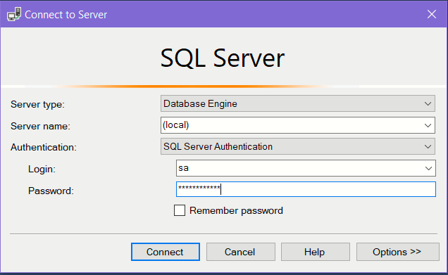

# Running a light weight MSSQL Server instance using Docker Desktop

# Who should read this?
- You are a learner curious to know more about this wonderful RDBMS. 
- You are a data analyst who needs a MSSQL instance where you want to load data by importing CSV files
- You are a .NET developer who needs a MSSQL database on the local workstation

I can think of the following options:
1. You can create a database on Azure Sql. This will cost you some money. Abou 5-10 GBP per month
1. You can install SQL Express. This is completely free
1. You can choose to run MSSQL via a Docker container.

In this article, I have laid bare the basic steps to get started with running Microsoft's MSSQL Docker image on your desktop. I like the Docker approach because it is not only free, but also, I can run MSSQL on demand. No need to hog memory and diskspace when idling.

# How to install Docker on Windows 10?
Docker has nicely described the steps in [this article](https://docs.docker.com/desktop/windows/install/). 

# How to pull an image which has MS SQL server installed?
Microsoft has published certified Docker images preloaded with various MS products. We need an image with SQL server.

## Pulling the image
```
docker pull mcr.microsoft.com/mssql/server
```

## How to verify that image was downloaded?
You have downloaded the image. How can we verify that the image was downloaded and registered with Docker Desktop?
```
docker images
```
Expected output
```
REPOSITORY                       TAG       IMAGE ID       CREATED      SIZE
mcr.microsoft.com/mssql/server   latest    d78e982c2f2b   9 days ago   1.48GB
```

# How to run the SQL Server image?
Docker Desktop has downloaded the image and we need to create a running instance of this image and have a functioning SQL server instance
```
docker run -e "ACCEPT_EULA=Y" -e "SA_PASSWORD=yourStrong(!)Password" -e "MSSQL_PID=Express" -p 1433:1433 -d --name mssql001 mcr.microsoft.com/mssql/server
```
## How do I see a list of running containers?
```
docker ps
```

Expected output

```
CONTAINER ID   IMAGE                            COMMAND                  CREATED              STATUS              PORTS                    NAMES
7dd76f25dc17   mcr.microsoft.com/mssql/server   "/opt/mssql/bin/perm…"   About a minute ago   Up About a minute   0.0.0.0:1433->1433/tcp   mssql001
```

# Understanding the arguments for DOCKER RUN
## -e,--env
Sets the environment variables
```
-e "name1=value2"
```

## -p, --publish
Publish the container's port to the host. Example:
```
-p 1433:1433
```
This will map the port 1433 of the container to 1433 of the host


## -d, --detach
This option starts the container and returns to the shell prompt.

## -v, --volume
This option will let you map a folder from the host computer as a folder in the image
```
-v c:\folderonhost\:/foldernameoncontainer
```
With the parameters listed above , the existing folder `c:\folderonhost\` on the host is made available as a new folder `/foldernameoncontainer` on the image. This is a very important option and allows the container to persist its state.

## --name option
Assign a name to the container. This name option simplifies futures operations such as `docker stop`


# How to connect to the SQL Server instance inside the new container?
You can use any of the following
- SQLCMD command line tool
- Invoke-SqlCmd PowerShell cmdlet
- SQL Server Management Studio
- Azure Data Studio

In this section, I have shown how to use **SQLCMD** and **Management Studio** .
## List all databases using SQLCMD
I have stored the password in the environment variable *password*
```
SQLCMD -S localhost -U sa -P %password% -d master -Q "select name  from sys.databases"
```

Expected output:
```
name
----------------------------------------------------------------------------
master
tempdb
model
msdb
```

## Using Sql Server Management Studio




# How to stop a running container?

```
docker stop [id of the container]
```
The id of the container is obtained by running `docker ps`. You could also use the explicit name if one was provided using the **--name** option
```
docker stop mssql001
```


# How to launch MSSQL server and also mount a volume?
This allows SQL Server to create it's MDF/LDF files on the host.
```
docker run -e "ACCEPT_EULA=Y" -e "SA_PASSWORD=%password%" -e "MSSQL_PID=Express" -p 1433:1433   -v c:\truetemp\dock001:/cooldata mcr.microsoft.com/mssql/server
```

# How to create a new database using Sql Server Management Studio?
In this step we are creating a new database such that the MDF and LDF files are created in the mounted volume **/cooldata**. This ensures persistence of the data. 
```
CREATE DATABASE [MyDatabase] 
    ON (NAME = N'MyDatabase', FILENAME = N'/cooldata/MyDatabase.mdf', SIZE = 1024MB, FILEGROWTH = 256MB)
LOG ON (NAME = N'MyDatabase_log', FILENAME = N'/cooldata/MyDatabase_log.ldf', SIZE = 512MB, FILEGROWTH = 125MB)
GO
```
I went ahead and created a simple **Employees** table in the database **MyDatabase**


You should also see the new MDF and LDF files on your host folder *c:\truetemp\dock001*

# How to re-attach the same database across container sessions?

## Step 1 - Select the Attach option from the context menu


## Step 2 - Select the mounted path
This is the folder we have mounted via the **-v** command line option


## Step 3 - Run some query


# Simplifying the re-attachment to your MDF/LDF files by specifying a default directory?
The steps described above are easily repeatable. We could slightly simplify the steps by instructing MSSQL that it should use the mounted folder as the default data directory. We would still need to use the "Attach Database" context menu. However, this folder selection will be initialized with the folder containing our data files
```
docker run -e "ACCEPT_EULA=Y" -e "SA_PASSWORD=%password%" -e "MSSQL_PID=Express" -e "MSSQL_DATA_DIR=/cooldata" -p 1433:1433   -v c:\truetemp\dock001:/cooldata mcr.microsoft.com/mssql/server
```

# Microsoft documentation

## Where to find information about MS SQL Server docker container?
https://hub.docker.com/_/microsoft-mssql-server?tab=description

https://docs.microsoft.com/en-us/sql/linux/sql-server-linux-docker-container-deployment?view=sql-server-ver15&pivots=cs1-bash

## Provide a default data directory
https://docs.microsoft.com/en-us/sql/linux/sql-server-linux-docker-container-configure?view=sql-server-ver15&pivots=cs1-powershell#changefilelocation


## How to pull a Docker image with latest SQL?
https://docs.microsoft.com/en-us/sql/linux/quickstart-install-connect-docker?view=sql-server-ver15&pivots=cs1-powershell#pullandrun2019

