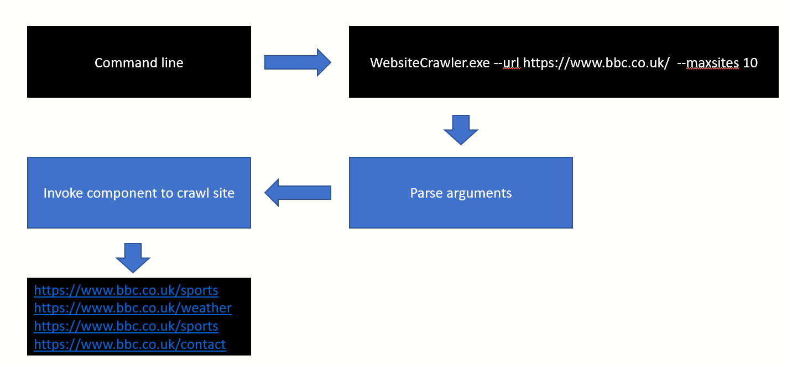
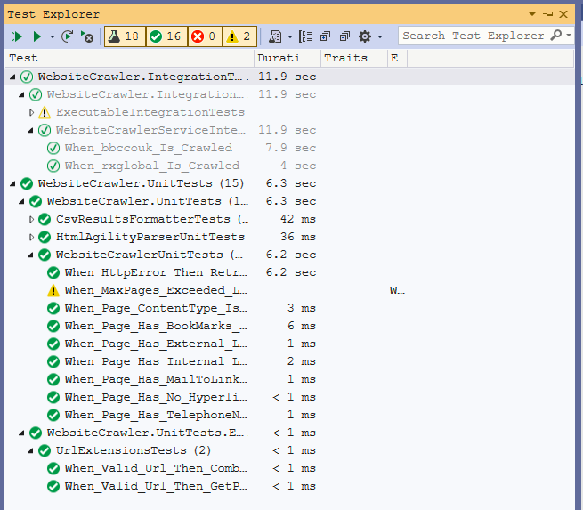
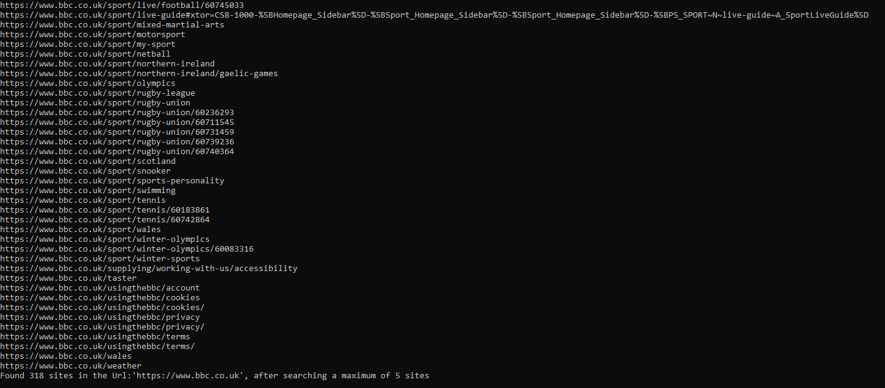
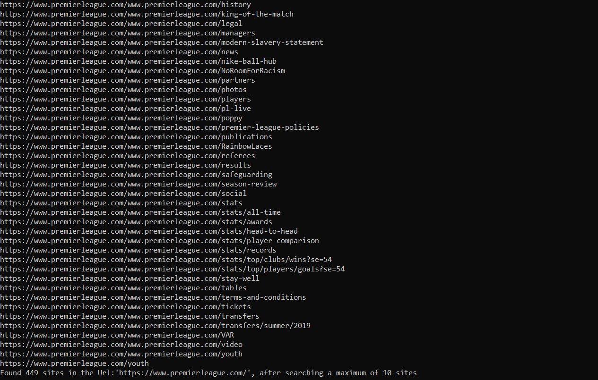
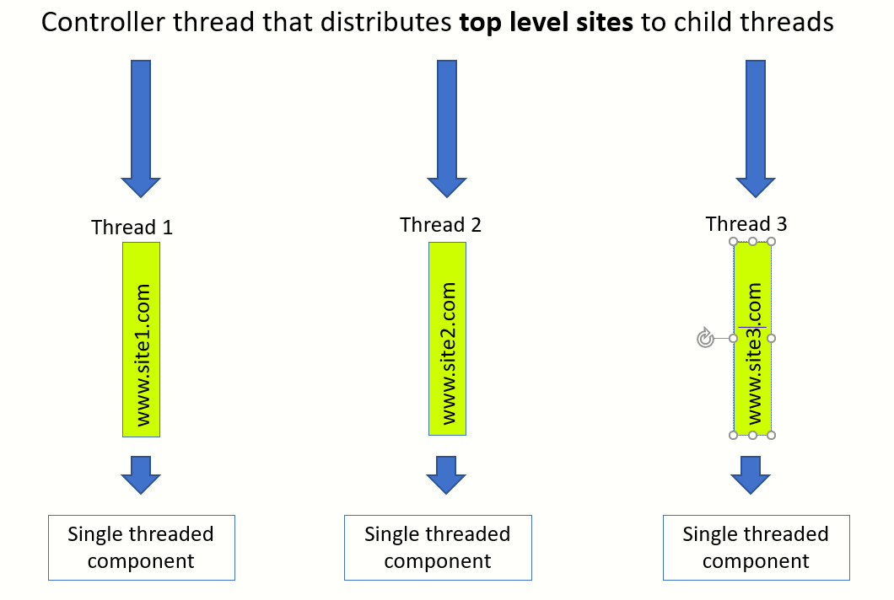

# Overview
This is an elementary Web site crawler written using C# on .NET Core . What do we mean by **crawling a web site** ? 
No! We are not indexing the content of the pages.

This is a simple component which will crawl through a web site (example: www.cnn.com), find sub-links and in turn crawl those pages . 
Only links which fall the under the domain of the parent site are accepted. 

# Implementation overview
The accompanying code produces a command line application. The results are written directly to the console.


## Sample output
Here is the output when https://www.cnn.com/ was crawled
```
https://www.cnn.com/videos/world/2021/11/16/uganda-explosions-madowo-live-nr-ovn-intl-ldn-vpx.cnn
https://www.cnn.com/videos/world/2021/11/17/lagos-nigeria-erosion-climate-change-ctw-busari-pkg-intl-vpx.cnn
https://www.cnn.com/videos/world/2021/11/19/blinken-says-ethiopia-on-path-to-destruction-sot-intl-ctw-vpx.cnn
https://www.cnn.com/videos/world/2021/11/25/davido-birthday-donations-orphanage-oneworld-intl-intv-vpx.cnn
https://www.cnn.com/videos/world/2021/11/29/salim-abdool-karim-south-africa-omicron-variant-covid-19-travel-ban-sot-newday-vpx.cnn
https://www.cnn.com/videos/world/2021/12/02/botswana-president-omicron-coronavirus-travel-bans-oneworld-intl-vpx.cnn
https://www.cnn.com/vr
https://www.cnn.com/warnermediaprivacy.com/opt-out
https://www.cnn.com/weather
https://www.cnn.com/world
https://www.cnn.com/www.cnn.com/interactive/travel/best-beaches
https://www.cnn.com/www.cnnpartners.com
https://www.cnn.com/youtube.com/user/CNN
Found 663 sites in the Url:'https://www.cnn.com', after searching a maximum of 30 sites
```

# What kind of hyperlinks are we processing?
Only links with references to pages on the same domain as the specified URL are extracted. 

## The following links are ignored:
- Any external site. E.g. www.twitter.com
- Links which are `mailto:` or `tel:` or `sms:`
- Bookmarks Example: `<a href='#chapter1'>Chapter 1</a>`
- Any link which produces a content type other than **text/html** is ignored. Example: A link to pdf document
- Any link which is under a sub-domain of the root domain.E.g. if the www.cnn.com was being crawled, then a link such as sports.cnn.com would be ignored

## The following links are accepted:
- `<a href='/contactus.htm'>Contact us</a>`
- `<a href='/Careers'>Careers</a>`
- if www.cnn.com was being crawled then `<a href='https://www.cnn.com/Careers'>Careers</a>` would be acceptable.

# How to compile and run the code?
The current version has been build on **Visual Studio 2019** and **.NET Core 3.1**

## Solution structure


## Unit and integration tests


## Running from command line
```dotnetcli
WebsiteCrawler.exe  --url https://www.cnn.com --maxsites 30
```

# Sample outputs
Here are some examples of the output produced by the web site crawler

#### WWW.BBC.CO.UK
```
WebsiteCrawler.exe --url https://www.bbc.co.uk --maxsites 5
```


#### WWW.CNN.COM
```
WebsiteCrawler.exe --url https://www.cnn.com --maxsites 30
```


#### WWW.PREMIERLEAGUE.COM
```
WebsiteCrawler.exe --maxsites 10 --url https://www.premierleague.com
```


# How are we parsing the HTML?
The component **HtmlAgilityPack** is being used for parsing the links out of a HTML fragment. Refer class `HtmlAgilityParser.cs`

# How are command line arguments being processed?
The component **CommandLineParser** is being used. This component uses the following model class to interpret the command line arguments:
```dotnetcli
    public class CmdLineArgumentModel
    {
        [Option("maxsites", Required = true, HelpText = "An upper limit on the number of sites to search. Example: 30")]
        public int MaxSites { get; set; }

        [Option("url", Required = true, HelpText = "The URL of the site to search")]
        public string Url { get; set; }
    }

```
Refer the [project site](https://github.com/commandlineparser/commandline) of this component for more information

# How are we logging?
All C# code is written with the expection that `ILogger<T>` would be injected via **Dependency Injection**.

#### Logging in the executable
**log4net** is being used. In the current implementation, the logging output is displayed on the **Console**

#### Logging in the unit tests and integration tests

Logging to the output window of Visual Studio helps in examining the log outputs.
```
        ILogger<SingleThreadedWebSiteCrawler> logger=CreateOutputWindowLogger<SingleThreadedWebSiteCrawler>();

        /// <summary>
        /// Helps you view logging results in the Output Window of Visual Studio
        /// </summary>
        private ILogger<T> CreateOutputWindowLogger<T>()
        {
            var serviceProvider = new ServiceCollection().AddLogging(builder => builder.AddDebug()).BuildServiceProvider();
            return serviceProvider.GetService<ILogger<T>>();
        }
```

# Scenarios that have not been tested

- Intergration test on the executable
- Explore if we have covered all HTTP status code while doing a Polly retry. 
- Better approach to recording errors. Currently being logged. Should have an errors collection and this should be unit tested
- Better approach to ignored links. Currently being logged. Can be incorporated as another collection.

# Further improvements
#### Making it multi-threaded
The current implementation is single threaded. This is obviously slow. A more sophisticated implementation would be broadly as follows:
```
start --->  master thread manages a queue of work items ---> spawns child Tasks --> each Task will pull first available item from work queue , parse links and add to same queue

```

#### Do we really stand to gain my making it multi-threaded?
Rewriting the component as a multithreaded is possible, but makes the coding and testing more complex.
But, what do we gain? Consider the scenario where we have a multiple sites to crawl (www.site1.com, www.site2.com, www.site3.com) . Why not created independent threads , one each for www.site1.com, www.site2.com and www.site3.com?
This might be a win-win solution.




## Specify output format
We could think of providing the ability to produce JSON format

## Can we make a full blown web crawler?
- We could turn this into an ASP.NET worker service 
- The service would be running as a Web job in Azure or in some container.
- The worker service would be passively waiting for messages in a queue
- Results would be written back to a database.
- Such a worker service could be made very resilient by managing state in an external data store. Example - Consider incrementally crawling a large web site over several hours.


