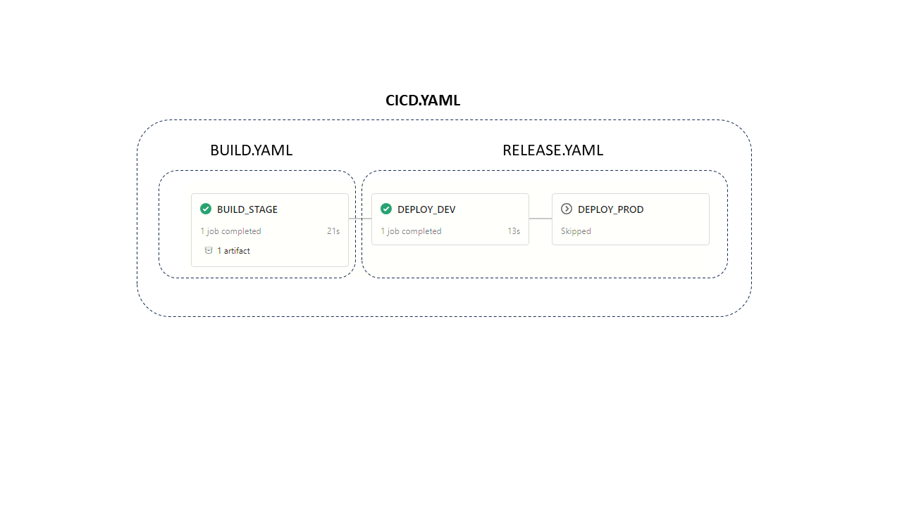
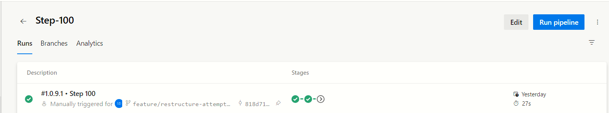
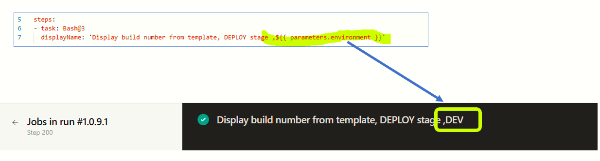
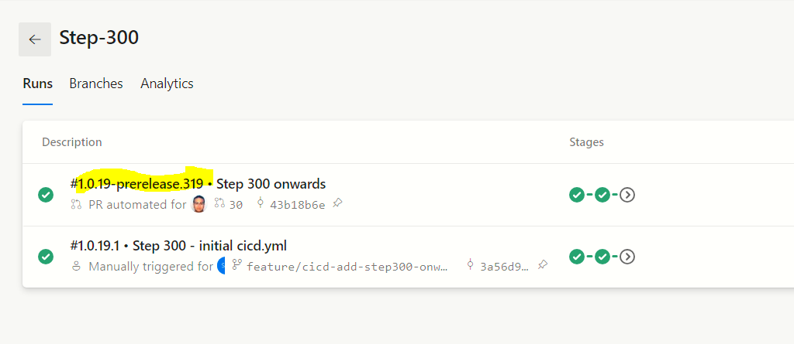
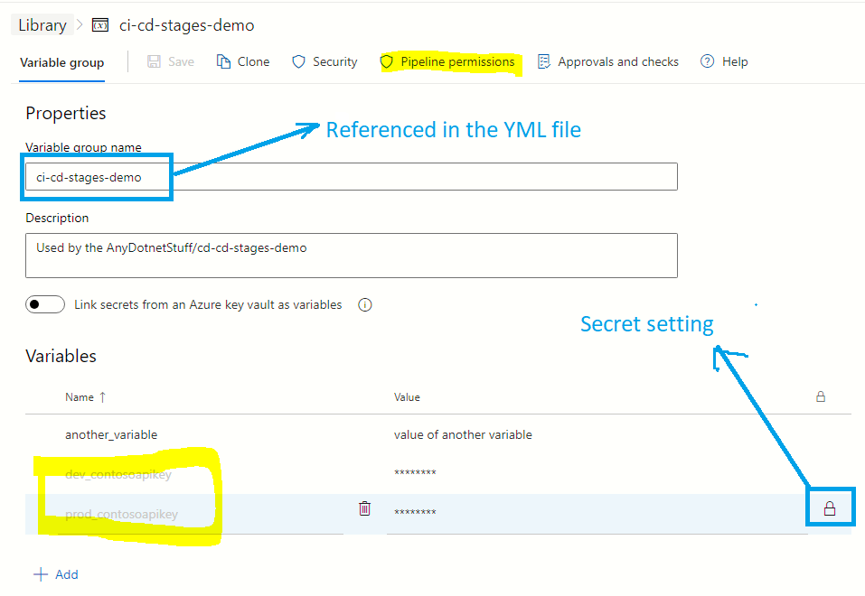
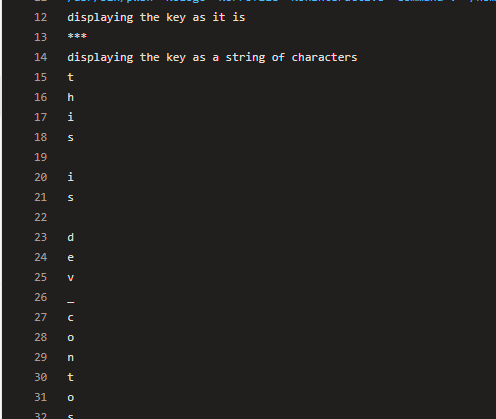
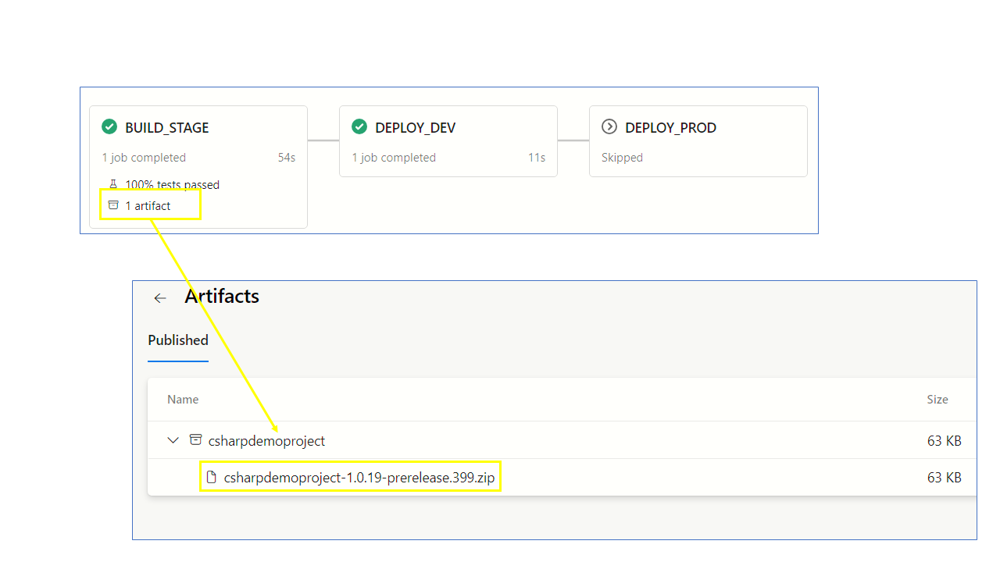

[[_TOC_]]

# Objective
Azure Devops in 2023 has gained wide popularity in the developer community. Azure Devops is a complete suite of tools to manage your software development lifecyle.  The self-service CI/CD features of Azure Devops is a very powerful automation tool that should not be ignored. You could be deploying web apps/services to the Cloud or publishing desktop applications or an in house data science team which wants to deploy its Python files to a job server .   YAML based pipelines of Azure Devops is a powerful CI/CD orchestration tool. However, it would be an understatement to conclude that this is an easy tool. I have found that authoring YAML based Azure Devops CI/CD pipelines can be time consuming and hard to troubleshoot at times. The lesson that I have learnt - keep the CI/CD simple and linear!  What do I mean by linear? Build stage, followed by a Dev deployment and then an Uat deployment and finally ending in a Prod deployment.

In this article I have demonstrated how to make the simplest build pipeline and progressively add more steps to it.  **Remember** - CI/CD is a means to an end - not an end by iteself. The end goal is to deliver software which solves end user problems.

---

# Source code and pipeline

#### Link to Repo
https://github.com/sdg002/AnyDotnetStuff/tree/master/ci-cd-stages-demo


#### Link to Devops pipeline
https://dev.azure.com/docxreview/devops001/_build?definitionId=8

---

# Step 100-Simple skeletal CI/CD YAML split into Build and Deployment stages

#### What do we want to achieve ?

- One **main YAML** which is the foundation for the one and only one CI/CD pipeline which implements both Build and Deploy roles
- Split into stages. One stage for **Build** and 2 subsequent stages for  **DEV Deployment** and **PROD Deployment** )
- Using 2 YAML templates. One for **Build** and the other for **Deploy**




#### YAML structure

```
    CICD.YML
        |
        |----BUILD ------------> template=>BUILD.YAML
        |
        |
        |----DEV_RELEASE ------> template=>RELEASE.YAML
        |
        |
        |----PROD_RELEASE -----> template=>RELEASE.YAML
        |
        |
```

#### YAML contents

```yml
trigger: 
  branches:
    include:
    - master 
  paths:
    include: 
    - /ci-cd-stages-demo/step100*


stages:
- stage: BUILD_STAGE
  jobs:
  - job: BUILD_STAGE_JOB
    steps:
    - template: ./build.yml

- stage: DEPLOY_DEV
  dependsOn: BUILD_STAGE
  jobs:
  - job: DEPLOY_DEV_JOB
    steps:
    - template: ./release.yml

- stage: DEPLOY_PROD
  dependsOn: DEPLOY_DEV
  condition: eq(variables['build.sourceBranch'], 'refs/heads/master') #Deploy on PROD only when master branch
  jobs:
  - job: DEPLOY_PROD_JOB
    steps:
    - template: ./release.yml


```

#### Build output
In the following illustration we can see the 3 stages. The **Build** and **DEV Deploy** are indicated in green. Whereas the **PROD Deploy** has not yet started because we have applied a condition on the branch being **master**.



---

# Step 200-Passing parameters to the various stages

#### What do we want to achieve?
Imagine a deployment pipeline which has a DEV and a PROD environment and we want to pass some context to the IaC (Infrastructure as code) so that the code can execute in the right environment.  Example: We want each envrionment to pick the environment specific SQL Server and execute the SQL scripts.

Lets do this by passing a parameter named **environment** to the **DEPLOY_DEV** and **DEPLOY_PROD** stages

#### How to access a parameter inside the child YAML ?

**Step 1** - Define the parameter within the template
```yml
parameters:
- name: environment # name of the parameter; required
  type: string # data type of the parameter; required

```

**Step 2** - Access the parameter value within the template

```yml
steps:
- task: Bash@3
  displayName: 'Display build number from template, DEPLOY stage ,${{ parameters.environment }}'
  inputs:
    targetType: 'inline'
    script: echo '$(Build.BuildNumber)'
```


#### How to pass a parameter from the parent YAML to the template YAML?

The following snippet demonstrates how to access the parameter value

```yml
- stage: DEPLOY_DEV
  dependsOn: BUILD_STAGE
  jobs:
  - job: DEPLOY_DEV_JOB
    steps:
    - template: ./release.yml
      parameters:
        environment: DEV

```

#### Results




#### Caveats
You cannot declare variables within a template. If you need a variable you could use a parameter with a default value.
```yml

#Not allowed
variables:
  SOME_VARIABLE: '20.10.12'

#Allowed
parameters:
- name: SOME_VARIABLE
  type: string
  default: '20.10.12'

``````
---

# Step 300-Semantic build name

#### Problem
We want to generate a [semantic build name](https://semver.org/).  Any release from a non-master branch should be as follows:
```
1.2.3-prerelease.100
```
A release from master branch would look:
```
1.2.3.100
```

#### How does a semantic name help ?

Examples:
1. A Python PIP package or a .NET nuget package expects to be named using a semantic version when pushed to an Artifacts repository
1. A Docker image inside a Container Registry follows a semantic tagging scheme 
1. DLLs can be versioned by passing on the semantic tag to `dotnet build/publish` commands. This significantly helps in associating the C# code with the pipeline build number

#### Not using the 3rd party Gitversion

One of the ways to do this is to use the [GitVersion Devops Task](https://github.com/GitTools/GitVersion). This is a sophisticated 3rd party tool that looks into your entire repository history and generates a incrementing semantic version. For this exercise, we will use out of box YAML expressions to dynamically generate a simple and unique semantic build name using just a couple of lines of YAML.

#### Snippet

In the following example we are setting the **name** of the Build  to a conditional custom variable **BuildName**. The Devops variable **Build.BuildId** gives us an unique and auto-incrementing number.

```yml

variables:
    - name: BuildName
      ${{ if eq(variables['Build.SourceBranchName'], 'master') }}:
        value: "${{ variables.MajorVersion }}.${{ variables.MinorVersion}}.${{ variables.PatchNumber }}.$(Build.BuildId)"
      ${{else}}:
        value: "${{ variables.MajorVersion }}.${{ variables.MinorVersion}}.${{ variables.PatchNumber }}-prerelease.$(Build.BuildId)"


name: "${{ variables.BUILDNAME }}"

```


#### Results

Notice the build name **1.0.19-prerelease.319** for non-master branch. 



---

# Step 400-Passing secret parameters to the Deploy stage

#### What do we want to achieve ?

- Think of deploying a Web application which interacts with an external RESTful end point. This end point requires a secret API key. We want to pass this secret value to the DEV and PROD deployment stages
- We want 2 separate api keys.  One for DEV and another for PROD.
- If you are having difficulty imagining api keys, then consider to be akin to database connection strings
- If this were a Docker image then these keys would be configured as environment variables
- If this were an Azure Web App or Azure Function then these keys would be passed to the application settings


#### Solution
- We will create an Azure Devops **Variable group**
- 2 variables (dev_contosoapikey, prod_contosoapikey)
- Extend the **parameters** section of the `release.yml` to accept a new parameter **apikey**
- Pass the `dev_contosoapikey` to the DEV stage of the deployment as a parameter. Do the same with `prod_contosoapikey`
- Examine the secret value using PowerShell (this is just for the purpose of initial verification only. Should be removed later on)


#### Step-1-Create a new Azure Devops Variable Group
In the following example we have created 2 secret variables **dev_contosoapikey** and **prod_contosoapikey** .




#### Step-2-Define a new parameter inside the deployment template
A new parameter **apikey** is declared under the parameters section of the deployment template.

```yaml

parameters:
- name: environment
  type: string
- name: apikey
  type: string

```

#### Step-3-Pass the secret to the deployment template
The value of the **apikey** is passed from the parent YML to the deployment YML template.

```yaml

- stage: DEPLOY_PROD
  dependsOn: DEPLOY_DEV
  condition: eq(variables['build.sourceBranch'], 'refs/heads/master')
  jobs:
  - job: DEPLOY_PROD_JOB
    steps:
    - template: ./release.yml
      parameters:
        environment: PROD
        apikey: $(prod_contosoapikey)

```

#### Step-4-Reference the variable group in the master YAML pipeline
The value of the **group** parameter must match the name of the **Variable group** on the Azure Devops portal

```yml

variables:
    - name: MajorVersion
      value: 1
    - name: MinorVersion
      value: 0
    - name: PatchNumber
      value: 19
    - group: ci-cd-stages-demo

```
#### Step-3-Access the secret variable in the deployment pipeline

Azure Devops is very protective about secrets. You will not be able to display any secret on the log files using conventional means. However, for the purpose of verification you could use the `ToCharArray` approach below.

```yml
- task: PowerShell@2
  displayName: 'Display api key'
  inputs:
    targetType: 'inline'
    script: |
      $x="${{ parameters.apikey}}"
      Write-Host "displaying the key as it is - will not work!"
      Write-Host $x
      Write-Host "displaying the key as a string of characters - this works! (Use this for troubleshooting only)"
      $x.ToCharArray()


```



---

# Step 500-Publish Build artifacts and consume them in Release stage

#### Problem
Imagine a simple C# executable project. We want a Build stage that does the following:
- Restore the NUGET packages
- Build and publish the binaires
- Export the binaries out of the Build step as an artifact

If the Build stage succeeds, then the published artifact(s) can be further processed in the subsequent Deployment stages.


#### Step-1-Add a C# executable
We have created a simple **C# Console EXE** project under the **src** folder of this Git repo.

#### Step-2-Add a task to restore all referenced NUGET packages

```
- task: DotNetCoreCLI@2
  displayName: 'dotnet restore'
  inputs:
    command: restore
    projects: 'ci-cd-stages-demo/src/**/*.csproj'

```

#### Step-3-Add a Test task
This will run all the unit tests in the specified projects.

```yml

- task: DotNetCoreCLI@2
  displayName: 'dotnet test'
  inputs:
    command: test
    projects: 'ci-cd-stages-demo/src/**/*Unittest*/*.csproj'


```
#### Step-4-Add Publish task
This will build the specified CSPROJ and produce the binaries in the specified output folder

```yml
- task: DotNetCoreCLI@2
  displayName: 'dotnet publish'
  inputs:
    command: publish
    publishWebProjects: false
    arguments: '/p:version=$(Build.BuildNumber) --configuration=Release --output $(Pipeline.Workspace)/csharpdemoproject'
    projects: ci-cd-stages-demo/src/MyDemoCSharp101/MyDemoConsoleApp1/MyDemoConsoleApp1.csproj
    zipAfterPublish: false
    modifyOutputPath: false

```
#### Step-5-Create a ZIP of the DLLs
The following snippet will create a ZIP of the output from the `dotnet publish` command

```yml
- task: ArchiveFiles@2
  displayName: 'Archive csharpdemoproject'
  inputs:
    rootFolderOrFile: '$(Pipeline.Workspace)/csharpdemoproject'
    includeRootFolder: false
    archiveFile: '$(Build.ArtifactStagingDirectory)/csharpdemoproject-$(Build.BuildNumber).zip'

```

#### Step-6-Publish the artifact in the Build stage
We have the binaries we want. But, what we want to export these out of the Build stage and retain them for future deployment. We need to publish the artifacts. 

We could be publishing more than one artifact. Example - We could be producing a compiled documentation as another build artifact


```yml

- task: PublishPipelineArtifact@1
  displayName: 'Publish Pipeline csharpdemoproject'
  inputs:
    targetPath: '$(Build.ArtifactStagingDirectory)/csharpdemoproject-$(Build.BuildNumber).zip'
    artifact: 'csharpdemoproject'
```




#### Step-7-Download the artifiact in the Release stage

Why do we need to download the artifact - it should be already there ? Yes - it is present on the disk of the Devops container. However, the physical files on the disk are ephemeral and cannot be relied upon. The artifact(s) published in the **Build** stage are persisted for months.

The following snippet instructs Azure Devops to download all artifacts that are published by the current pipeline.

```yml

- task: DownloadPipelineArtifact@2
  inputs:
    artifact: 
    path: $(Build.Workspace)/ci-cd-stages-demo/artifacts

```

# What do we with the pipeline artifacts?

You have the artifacts produced by the **Build** stage. What are the possible ways we might consume these artifacts in the Release stage ?


#### Example 1 - Copy over the binaries to a network share
This would be a simple PowerShell task or a Script task that would XCOPY the binaries to a network file share. Example - An Excel addin that (.XLL) file.

#### Example 2 - Make a setup.exe for your executable

You could use Visual Studio Installer or [Wix Toolset](https://wixtoolset.org/) to create an intsallation package and then copy over the MSI/SETUP.EXE to a network share

#### Example 3 - Deploy to an Azure Web App or Azure Functions
If using Azure App Services, then deployment could be done using the following:
```
az webapp deploy --name devmycrmwebapp --resource-group rg-dev-crm-apps --type zip --restart true
```


The above assumes the prior presence of an [Azure App Service Plan](https://learn.microsoft.com/en-us/azure/app-service/overview-hosting-plans) and Azure App Service.

#### Example 3 - Create a Docker image
If deploying to a Cloud infrastructure, this might be the most likely scenario

Example:

```
az acr build --resource-group rg-crm-dev --registry acr-dev --file MyDockerFile --image  mcr.microsoft.com/dotnet/aspnet:5.0 --target mycrm-dev-$(Build.BuildNumber)

```

---

# Step-600-Deploy a containerized Python Application
## Problem
- Imagine a hypothetical Python application which contains scheduled jobs. 
- For the purpose of demonstraton we have used the [APScheduler component](https://apscheduler.readthedocs.io/en/3.x/userguide.html) with a couple of dummy job implementations
- In this section we will delive into deploying this application as a containerized application from the Deployment stage of our CI-CD pipeline


## Anatomy of a containerized Python application

```
----
    |
    +--src----
    |        |
    |        |---sample_job.py
    |        |
    |        |
    |
    +--tests--
    |        |
    |        |---test_demo.py
    |        |
    |
    |--requirements.txt
    |
    |--Dockerfile
    |
    |--.dockerignore
    |
    |--pytest.ini
    |
    +--.venv
    |        
    |        
    +--.vscode
    |        
    |        
    
    

```

## Problem
- Sample code to run a scheduled job every 1 minute
- Deploy a batch job which runs on a schedule
- Dockerfile
- Copy python source, 
- Supply some dummy environment variables
- Install requirements
- You would then do a Docker push

You were here - Try the docker build, then talk about how to push to ACR
## blah

---
# Docker notes

#### Build

```
docker build  .
```

```
docker build  . -t cicddemo
```

```
docker run --rm cicddemo
```

#### Why does the problem-Docker build requires 1 Argument
https://www.baeldung.com/ops/docker-build-argument-error#:~:text=The%20most%20common%20reason%20for,default%20we%20provided%20dot(.)

---
# References and articles

#### Templates usage reference
https://learn.microsoft.com/en-us/azure/devops/pipelines/process/templates?view=azure-devops&pivots=templates-includes

#### How to use parameters ?
https://damienaicheh.github.io/azure/devops/2021/02/10/variable-templates-azure-devops-en.html

#### Publish and download pipeline Artifacts
https://learn.microsoft.com/en-us/azure/devops/pipelines/artifacts/pipeline-artifacts?view=azure-devops&tabs=yaml

#### Azure Devops variable groups
https://learn.microsoft.com/en-us/azure/devops/pipelines/library/variable-groups?view=azure-devops&tabs=yaml

#### Build your ASP.NET Core application outside of the Docker container
https://bartwullems.blogspot.com/2021/05/build-your-aspnet-core-application.html

#### Azure Container Registry for building a docker image
https://learn.microsoft.com/en-us/cli/azure/acr?view=azure-cli-latest#az-acr-build

#### AP Scheduler - Using the simple Blocking scheduler
https://apscheduler.readthedocs.io/en/3.x/modules/triggers/cron.html?highlight=BlockingScheduler#examples

#### AP Scheduler - How to use decorators to defined scheduled jobs?
https://apscheduler.readthedocs.io/en/3.x/modules/triggers/cron.html?highlight=decorator

#### AP Scheduler - Good article with explanation of triggers and more
https://betterprogramming.pub/introduction-to-apscheduler-86337f3bb4a6

---

