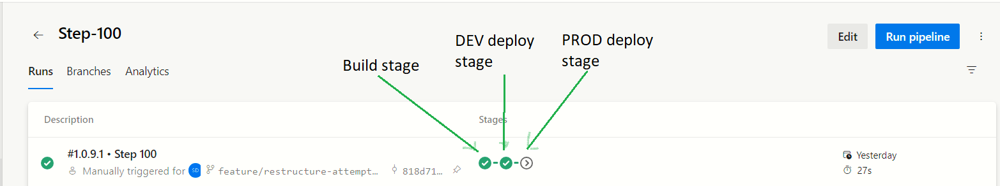

[[_TOC_]]

# Objective
Azure Devops in 2023 has gained wide popularity in the developer community. Azure Devops is a completel suite of tools to manage your software development lifecyle.  The CI/CD is one of the major components of Azure Devops. You could be using Azure Devops for the product management , but you could be using some other tool for CI/CD (e.g. Jenkins and Octopus).  YAML based pipelines of Azure Devops is a powerful CI/CD orchestration tool. However, it would be an understatement to state that this is an easy tool. I have found that authoring Azure Devops CI/CD can be time consuming and hard to troubleshoot at times. The lesson that I have learnt - keep the CI/CD simple and linear!  (I will explain what I mean by linear)


---

# Source code and pipeline

#### Link to Repo
https://github.com/sdg002/AnyDotnetStuff/activity?ref=master


#### Link to Devops pipeline
https://dev.azure.com/docxreview/devops001/_build?definitionId=8

---

# Step 100-Simple skeletal CI/CD YAML with 1 BUILD and 1 DEV_DEPLOY stages

#### What do we want to achieve ?

- 1 master YAML which is the foundation for the one and only 1 build and release pipeline
- Split into stages (BUILD, DEPLOY_DEV and DEPLOY_PROD )
- Using 2 YAML templates. One for Build and the other for Deploy

<!--
Improvements needed in the picture.
Indicate that we are using templates and each of the stages is impelemented by a template
-->


#### YAML structure

```
    CICD.YML
        |
        |----BUILD ------------ BUILD.YAML
        |
        |
        |----DEV_RELEASE ------ RELEASE.YAML
        |
        |
        |----PROD_RELEASE ----- RELEASE.YAML
        |
        |
```

#### YAML contents

```yml
trigger: 
  branches:
    include:
    - master 
  paths:
    include: 
    - /ci-cd-stages-demo/step100*

variables:
    - name: MajorVersion
      value: 1
    - name: MinorVersion
      value: 0
    - name: PatchNumber
      value: 9

pool:
  vmImage: 'ubuntu-latest'


name: $(MajorVersion).$(MinorVersion).$(PatchNumber).$(Rev:r)
#This becomes the Display on the Azure Devops portal, refer variable Build.BuildNumber
stages:
- stage: BUILD_STAGE
  jobs:
  - job: BUILD_STAGE_JOB
    steps:
    - template: ./build.yml

- stage: DEPLOY_DEV
  dependsOn: BUILD_STAGE
  jobs:
  - job: DEPLOY_DEV_JOB
    steps:
    - template: ./release.yml

- stage: DEPLOY_PROD
  dependsOn: DEPLOY_DEV
  condition: eq(variables['build.sourceBranch'], 'refs/heads/master')
  jobs:
  - job: DEPLOY_PROD_JOB
    steps:
    - template: ./release.yml


```

#### Build output

Show a picture of Azure Devops with Buld number




---

# Step 200-Passing parameters to the various stages

#### What do we want to achieve?
Imagine a deployment to DEV and PROD environments and we want to pass some context to the IaC (Infrastructure as code) so that the code can execute in the right environment. Lets do this by passing a parameter to the **DEPLOY_DEV** and **DEPLOY_PROD** stages

#### How to access a parameter inside the child YAML ?

**Step 1** - Define the parameter with the template
```yml
parameters:
- name: environment # name of the parameter; required
  type: string # data type of the parameter; required

```

**Step 2** - Access the parameter value
```yml
steps:
- task: Bash@3
  displayName: 'Display build number from template, DEPLOY stage ,${{ parameters.environment }}'
  inputs:
    targetType: 'inline'
    script: echo '$(Build.BuildNumber)'
```


#### How to pass a parameter from the parent YAML to the template YAML?

The following snippet demonstrates how to access the parameter value

```yml
- stage: DEPLOY_DEV
  dependsOn: BUILD_STAGE
  jobs:
  - job: DEPLOY_DEV_JOB
    steps:
    - template: ./release.yml
      parameters:
        environment: DEV

```

#### Results


---

# Step 300-Semantic build name

## Problem
We want to generate a [semantic build name](https://semver.org/).  Any release from a non-master branch should be as follows:
```
1.2.3-prerelease.100
```
A release from master branch would look:
```
1.2.3.100
```

## Not using the 3rd party Gitversion

One of the ways to do this is to use the [GitVersion Devops Task](https://github.com/GitTools/GitVersion). This is a sophisticated 3rd party tool that looks into your entire repository history and generates a incrementing semantic version. For this exercise, we will use out of box YAML expressions to dynamically generate a simple and unique semantic build name using just a couple of lines of YAML.

## Snippet

In the following example we are setting the `name` of the Build to a conditional custom variable `BuildName`
```yml
    - name: BuildName
      ${{ if eq(variables['Build.SourceBranchName'], 'master') }}:
        value: "${{ variables.MajorVersion }}.${{ variables.MinorVersion}}.${{ variables.PatchNumber }}.$(Build.BuildId)"
      ${{else}}:
        value: "${{ variables.MajorVersion }}.${{ variables.MinorVersion}}.${{ variables.PatchNumber }}-prerelease.$(Build.BuildId)"


name: "${{ variables.BUILDNAME }}"

```


## Evidence


---

# Step 400-Paramterizing the Deploy stages and passing secrets

You were here.
- Talk about purpose of passing an API key
- Picture of Variable group (link to MS resource)
- Show a snippet how to access a variable group?
- Passing a secure variable to a deployment stage
- Displaying the value of a secure variable (for the purpose of a troubleshooting)

## What do we want to achieve ?

- We want to pass a secret variable to the DEV and PROD deployment stages Example - think of this as an api key that would have been used by a Web application to interact with an extenal REST data feed.
- We want 2 separate api keys.  One for DEV and another for PROD.

## Solution
- We will create an Azure Devops variable group
- 2 variables (dev_contosoapikey, prod_contosoapikey)
- Pass the `dev_contosoapikey` to the DEV stage of the deployment. Do the same with `prod_contosoapikey`
- Examine the secret using PowerShell (this is just for the purpose of initial verification. Should be removed later on)


## Step-1-Create a new Azure Devops Variable Group


## Step-2-Reference the variable group in the master YAML pipeline

```yml

variables:
    - name: MajorVersion
      value: 1
    - name: MinorVersion
      value: 0
    - name: PatchNumber
      value: 19
    - group: ci-cd-stages-demo

```
## Step-3-Access the secret variable in the deployment pipeline

Azure Devops is very protective about secrets. You will not be able to display any secret on the log files using conventional means

```yml
- task: PowerShell@2
  displayName: 'Display api key'
  inputs:
    targetType: 'inline'
    script: |
      $x="${{ parameters.apikey}}"
      Write-Host "displaying the key as it is - will not work!"
      Write-Host $x
      Write-Host "displaying the key as a string of characters - this works!"
      $x.ToCharArray()


```


---

# References and articles

#### Templates usage reference
https://learn.microsoft.com/en-us/azure/devops/pipelines/process/templates?view=azure-devops&pivots=templates-includes

#### How to use parameters ?
https://damienaicheh.github.io/azure/devops/2021/02/10/variable-templates-azure-devops-en.html

#### Publish and download pipeline Artifacts
https://learn.microsoft.com/en-us/azure/devops/pipelines/artifacts/pipeline-artifacts?view=azure-devops&tabs=yaml

---
