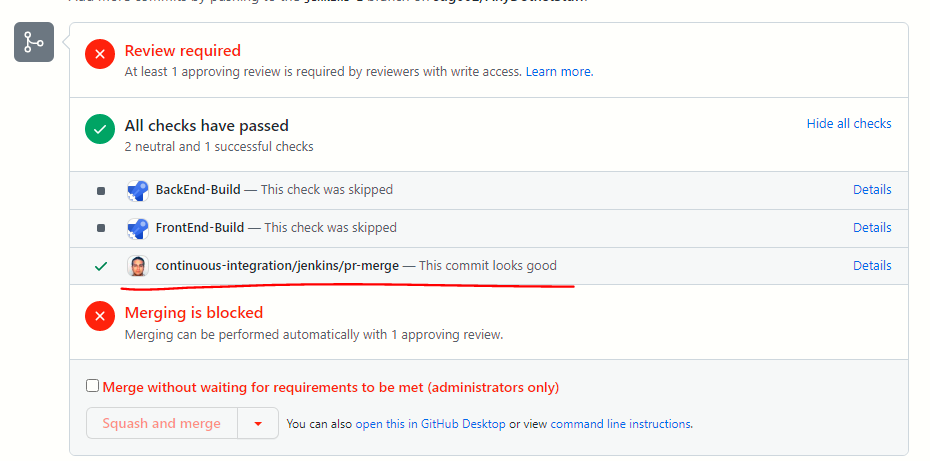

# Objective
to be done

# Some screen captures
to be done

# Nice videos
How to create 
[How to Create a GitHub Branch Source Multibranch Pipeline in Jenkins](https://www.youtube.com/watch?v=aDmeeVDrp0o&t=1323s)

# To be done

Document the steps for creating a mono-repo
Why you should select Github and not Git?
Why you should select Github App and not PAT token for authentication?

How to covert PEM private key to PKCS8 format?
https://8gwifi.org/pemconvert.jsp

Find out how to embed the video in markdown?

Add to your Medium article

Find out how to prevent interference between the build checks across the sub-repos within a mono-repo?

You have used a `when` clause with `changeset` condition. Is that the best practice?

Things to be done  - read above

