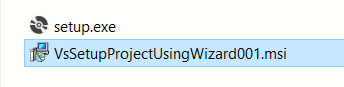
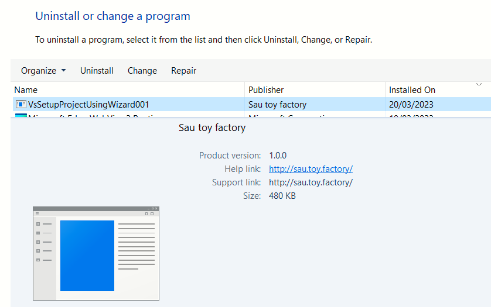
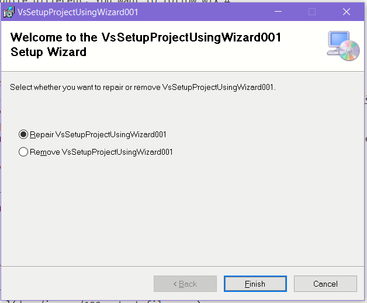
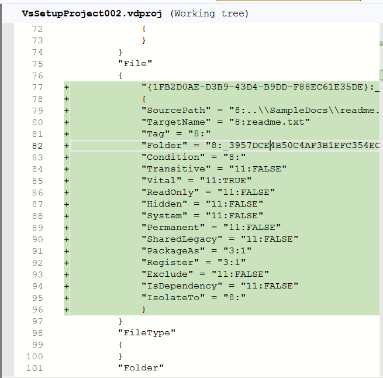
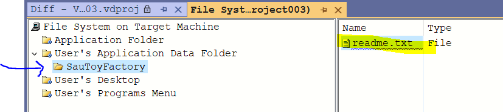
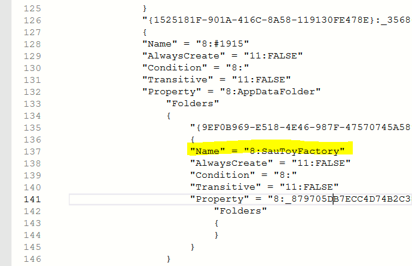

[[_TOC_]]

# About
This is a simple project that demonstrates how to use Wix setup tools via Visual Studio 2022

# Vs Extension
https://marketplace.visualstudio.com/items?itemName=WixToolset.WixToolsetVisualStudio2022Extension

# Wix tools
I downloaded the binaries because of the possiblity of adding to GIT
- Landing page https://wixtoolset.org/docs/wix3/
- Github Releases https://github.com/wixtoolset/wix3/releases/tag/wix3112rtm

# Tutorials
- https://www.add-in-express.com/creating-addins-blog/2014/04/08/creating-standard-install-package-wix-designer/
- [Old and very good CodeProject article](https://www.codeproject.com/Tips/105638/A-quick-introduction-Create-an-MSI-installer-with)

# Where was I ?
- Create a skeletal setup project using Wix3 project template
- Pressed Build. Error - Severity	Code	Description	Project	File	Line	Suppression State
Error		The WiX Toolset v3.11 build tools must be installed to build this project. To download the WiX Toolset, see https://wixtoolset.org/releases/v3.11/stable	SetupProject1	C:\Users\saurabhd\AppData\Local\Temp\VsTempFiles\s4m3mdbh.q1c\Temp\SetupProject1.wixproj	27	
- I am ignoring those errors
- I have brought in the Wix binaries (ZIP file ,extracted and added to GIT)
- Following the CodeProject step by step article
- I was reading the article https://wixtoolset.org/docs/fourthree/
- I was then reading the guidance on Visual Studio 2022 Setup projects

# What did I learn about Wix 3?
- Use `candle.exe` on the *Product.WXS** file. This produces **Product.wixobj**
- Use `light.exe` on the **Product.wixobj** to produce **Product.msi**
- The output is generated in the current folder unless you use the **-out** option
- Wix3 and Wix 4 are quite different. You want to follow Wix 4
- 

# Moving on to Wix 4
- You were reading this https://wixtoolset.org/docs/fourthree/

# Visual Studio 2022 Setup project
- You were reading this https://learn.microsoft.com/en-us/visualstudio/deployment/installer-projects-net-core?view=vs-2022
- I had to install the VS 2022 Setup Project from the extensions menu
- I created a VS Setup project
- I add the file readme.txt from the SampleDocs project. Right click on the Setup project and click Add File.

## How does a relative file path look like?
```
            "SourcePath" = "8:..\\SampleDocs\\readme.txt"
            "TargetName" = "8:readme.txt"
```
---

# 100 - Using the Wizard

## What are the output files?


## How does the installed package appear on the Control Panel ?


## Installation path dialog

### First dialog


### Second dialog


## Uninstallation prompt


---

# 200 - Without the wizard

## Adding a deployment file to the setup project


## Change manufacturer properties


---
300 - Without the wizard

## Added the AppData folder and a sub-folder




## Skip Administrative install
???


## Alter Installation folder
???

## Uninstall older versions
???


---

# Good tutorial on UI customization
https://www.c-sharpcorner.com/article/deployment-customizing-your-net-deployment-projects/

Just added a new dialog. Lots of stuff got added to the VDPROJ file

